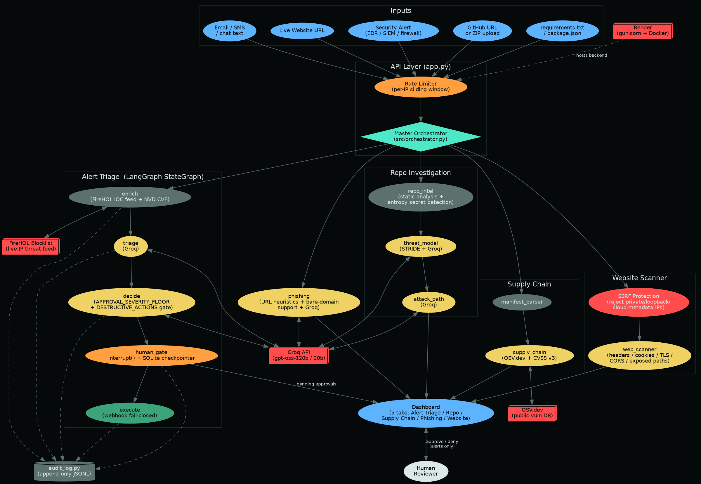

# Architecture — Security Autopilot Agent



## Overview

A platform, not a single tool: one Master Orchestrator routes four
kinds of input — a security alert, a GitHub repo/ZIP, a dependency
manifest, or a suspicious message — to the specialist flow that handles
it, and every flow produces the same shape of answer (summary, risk
score, evidence, recommendation).

Only one of the five flows takes real action (alert triage's
remediation execution); the other four are investigation-only and never
touch a target system. Where a flow *can* act on real infrastructure,
destructive actions are hard-gated behind human approval in code, not
left to an LLM's judgment.

## Flow diagram (text fallback)

```
Inputs: Alert · GitHub URL/ZIP · requirements.txt/package.json · Message
                          │
                          ▼
        Master Orchestrator (app.py routes + src/orchestrator.py)
                          │
      ┌───────────────┬───┴────────────┬────────────────┐
      ▼                ▼                ▼                ▼
 Alert Triage      Repo Investigation  Supply Chain    Phishing/Scam
 (LangGraph)        repo_intel ──▶      manifest_    phishing.py
 enrich──▶triage──▶  threat_model ──▶   parser──▶     (heuristics
 decide──▶human_     attack_path        supply_chain   + Groq)
 gate──▶execute      (STRIDE + Groq)    (OSV.dev)
      │                   │                 │              │
      ▼                   └────────┬────────┴──────────────┘
 audit_log.py                      ▼
 (append-only)              Dashboard (static/index.html, 4 tabs)
      │                             │
      ▼                             ▼
 human_gate ◀──── approve/deny ──── Human reviewer
 (alerts only — the other 3 flows are investigate-and-report, no
  destructive action to gate)

External services: Groq API (all LLM reasoning) · OSV.dev (real
vulnerability data) · GitHub codeload (repo fetch) · Render (hosting)
```

## Why a graph, not a single prompt (alert triage)

Each stage of alert triage is a separate LangGraph node with its own
narrow responsibility (enrich, triage, decide, gate, execute) rather
than one big prompt asking the model to "handle the alert." This keeps
every model call auditable and narrow-scoped, and — critically — lets
the human-in-the-loop gate be a real pause in *program* execution
(LangGraph's `interrupt()` + a SQLite-backed checkpointer), not just a
prompt instruction the model could ignore or hallucinate past.

## The human-in-the-loop gate

`human_gate` is where "human sign-off before destructive action" is
implemented concretely, not just promised:

- Low-risk actions (`notify_only`, `open_ticket`) auto-approve and flow
  straight to execution — unless `APPROVAL_SEVERITY_FLOOR` overrides
  that for a severe-enough alert (see "Two independent, model-can't-
  lower safety floors" below).
- `block_ip`, `quarantine_host`, and `disable_account` are hard-gated —
  enforced in code (`DESTRUCTIVE_ACTIONS` in `src/models.py`), not left
  to the LLM's judgment, because a model can be wrong or manipulated by
  adversarial content inside the alert text itself (e.g. a log line
  crafted to talk the model out of asking for approval). The gate is a
  safety floor the model cannot lower.
- When gated, `interrupt()` pauses the graph and returns the pending
  decision to the caller. State is checkpointed to a local SQLite file
  (`GRAPH_CHECKPOINT_PATH`), not the default in-memory-only
  checkpointer, so approval can genuinely come from a different HTTP
  request — or a different process, after a restart — minutes or hours
  later, and the graph resumes exactly where it left off via
  `Command(resume=...)`. Resuming only needs the alert's own id
  (`thread_id`), not a live reference to whichever Python object was
  compiled before any restart.

## Why the other four flows don't have a human gate

Repo investigation, supply chain, and phishing analysis never execute
anything against a real system — they read (a repo, a manifest, a
message) and report. There's no destructive action to gate. This is a
deliberate scope boundary (see the README's "known limitations" and
roadmap), not an oversight: adding real remediation for these flows
(auto-opening a PR to fix a vulnerable dependency, auto-blocking a
phishing domain) would need the same hard-gated approval pattern as
alert triage before it should ever be built.

## Grounding LLM reasoning in real findings

Every prompt in `src/groq_client.py` for the investigation flows
(threat modeling, attack path, phishing) is explicitly instructed to
reason only from the findings it's handed and never invent an endpoint,
secret, vulnerability, or URL indicator that the deterministic layer
(`repo_intel.py`, `manifest_parser.py`, `phishing.py`'s heuristics)
didn't actually find. The LLM's job in these flows is to add the
reasoning a mechanical rule can't express — chaining findings into a
narrative, writing a plain-English summary, weighing ambiguous evidence
— not to originate findings from nothing.

The threat model's overall risk score is also never allowed to go
*below* the worst deterministically-detected finding, even if the LLM
assigns a lower one (`threat_model.py::build_threat_model`) — the
mechanical layer is ground truth from real static analysis and
shouldn't be talked down by the model's own summary judgment.

## Handling ambiguous input (alert triage)

The `enrich` step runs before triage specifically so the model isn't
classifying alerts in a vacuum — it sees local IOC matches and any CVE
references resolved against NVD before deciding severity. The triage
prompt is explicitly instructed to default toward lower severity absent
clear evidence, so ambiguous alerts don't get inflated into
unnecessary human interruptions (alert fatigue is itself a security
risk).

## External tool calls

1. **Threat intel enrichment** (`src/threat_intel.py` + `src/ioc_feed.py`)
   — real live IP blocklist (FireHOL's `level1` netset, cached with a
   TTL rather than fetched per-alert) + optional live NVD CVE API lookup.
2. **Remediation execution** (`src/remediation.py`) — destructive and
   externally-visible actions (`block_ip`, `quarantine_host`,
   `disable_account`, `open_ticket`) POST to a webhook you configure
   (`REMEDIATION_WEBHOOK_URL`), pointed at your real SOAR/firewall/EDR/
   IdP automation. Deliberately fail-closed: unconfigured or a failed
   call both report `success=False`, never a fabricated success — see
   the module's own docstring for the reasoning.
3. **OSV.dev** (`src/supply_chain.py`) — `POST /v1/querybatch` for bulk
   vulnerability lookup, then `GET /v1/vulns/{id}` to hydrate only the
   packages that actually had hits (not every package regardless of
   result).
4. **GitHub codeload** (`src/orchestrator.py`) — downloads a public
   repo's ZIP directly (`codeload.github.com/{owner}/{repo}/zip/...`),
   no `git` binary or auth needed for public repos.

## Two independent, model-can't-lower safety floors

`DESTRUCTIVE_ACTIONS` (in `src/models.py`, applied in
`groq_client.plan_remediation`) gates by **what the action is** —
`block_ip`/`quarantine_host`/`disable_account` always require approval
regardless of the model's own judgment. `APPROVAL_SEVERITY_FLOOR`
(applied in `graph._decide_node`) gates independently by **how severe
the alert is** — a `CRITICAL` alert requires human approval even if the
model recommends the lowest-risk action (`notify_only`) and says no
approval is needed. Neither floor can be talked down by the model;
they're both checked in code after the LLM call returns, not left to
the model to enforce on itself.

## Security note: the analysis tool is itself hardened

A repo-analysis tool that's vulnerable to zip-slip path traversal on
the archives it's asked to analyze would be a real vulnerability, not a
hypothetical one, given what this project does.
`orchestrator._safe_extract()` rejects any zip entry whose resolved
path would land outside the extraction directory — verified in
`tests/test_orchestrator.py` against both a relative-traversal
(`../../etc/evil`) and an absolute-path payload.

The same function also enforces `MAX_ZIP_UNCOMPRESSED_BYTES` and
`MAX_ZIP_FILE_COUNT` (zip-bomb protection) by counting actual bytes
written during a streamed extraction — not by trusting the archive's
own declared size metadata, which a crafted zip can misreport. Tested
against a real zip bomb (a few KB compressed, declaring megabytes
uncompressed), not a mock.

Every Flask route also validates its JSON body is genuinely an object
of the expected shape before touching it — a crash-test battery run
against the live app (malformed JSON shapes, wrong types, missing
fields, oversized/unicode/null-byte payloads) found and fixed several
places where a JSON array, `null`, or missing field would have reached
unguarded dict-key access and crashed with a raw 500. A global
`@app.errorhandler(Exception)` exists as a last-resort safety net, but
routes validate their own input rather than relying on it.

## Deployment

`render.yaml` defines a Docker-runtime web service on Render, health
-checked at `/healthz`, with `GROQ_API_KEY` injected via the Render
dashboard rather than committed (`sync: false`). The same `Dockerfile`
is used for local `docker run` and Render's build — building/running it
locally is a faithful preview of deployed behavior.
